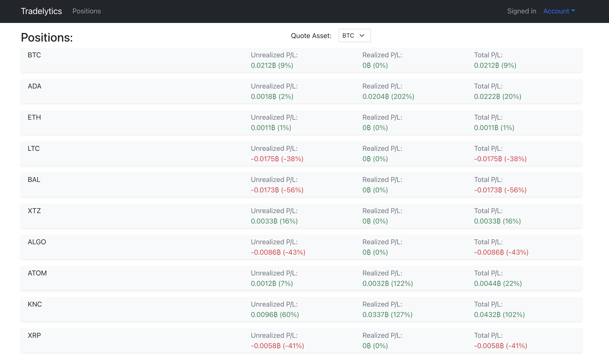

# Tradelytics



# Usage  

- Make sure you have Docker installed
- Run the following command:
```ssh
./docker.sh init
```
You can access Tradelytics by opening your browser at `http://localhost:3007`. 
The default login is `admin` password `admin`